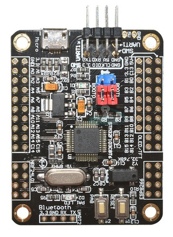
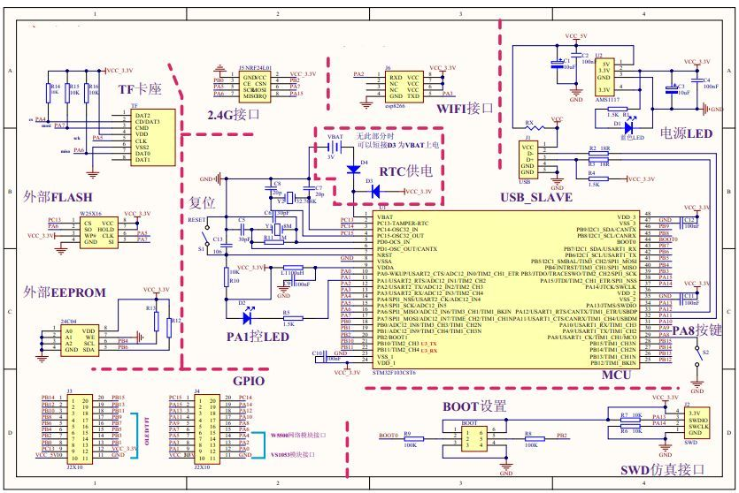

# Schematic for the STM32F103C8 ARM mini system development board

This is a schematic for the STM32F10C8 ARM mini system development board sold by
a number of low-cost Aliexpress sellers. It is re-drawn from a fuzzy JPEG shown by
most of the sellers of this board which appears to be the only available documentation.

The board is an STM32F103C8 microcontroller with lots of connections available for commonly
used peripherals like the nRF23L01 and ESP8266 boards and EEPROM and FLASH chips.

Unfortunately the only available schematic is hard to read so this one has been redrawn.

It passes a DRC check but is otherwise unverified.

A [PDF schematic](stm32_dev_board.pdf) has been generated for those who do not use [GEDA](http://www.geda-project.org/) gschem.

## NOTE

The ESP8266 pin-out on the original uses unusual pin numbering and this has been changed in this
schematic to correspond to the pin numbering commonly described for the ESP-01 board. This board has
a square marking on the GND pin and is normally considered to be pin 1 with the numbers alternating
on either side.

    1 | 3  | 5  | 7
    2 | 4  | 6  | 8

This is the only intentional change to the original schematic.

